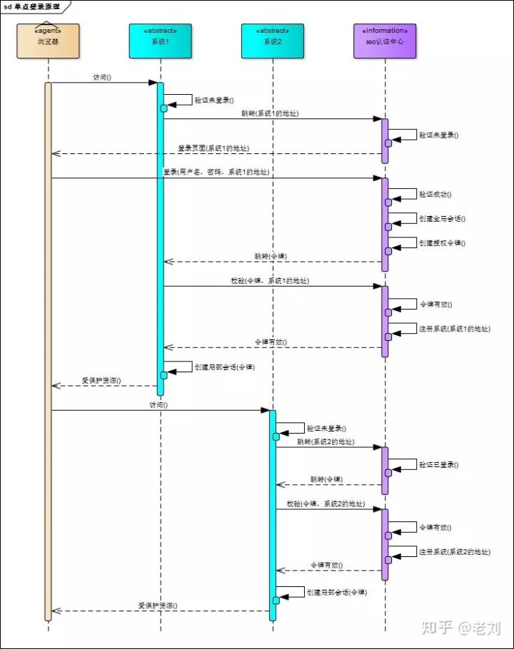

https://www.jianshu.com/p/613c615b7ef1

# 系统登录机制

**cookie保存会话id**

单系统登录解决方案的核心是cookie+session：

- cookie携带会话id
- 服务器保存session

但cookie是有限制的，这个限制就是cookie的域（通常对应网站的域名），**浏览器发送http请求时会自动携带与该域匹配的cookie**，而不是所有cookie

多系统下的解决办法可以是同域名共享cookie。缺点：

1. 应用群域名得统一
2. 应用群各系统使用的技术（至少是web服务器）要相同，不然cookie的key值（tomcat为JSESSIONID）不同，无法维持会话，共享cookie的方式是无法实现跨语言技术平台登录的，比如java、php、.net系统之间
3. cookie本身不安全

**session劫持**

只要用户知道JSESSIONID，该用户就可以获取到JSESSIONID对应的session内容。

换个浏览器设置cookie后就可以访问站点

> 并不是没有 Cookie 之后就不能用 Session 了，比如你可以将SessionID放在请求的 url 里面`https://javaguide.cn/?session_id=xxx` 。这种方案的话可行，但是安全性和用户体验感降低。当然，为了你也可以对  SessionID 进行一次加密之后再传入后端。

# 单点登录原理

相比于单系统登录，sso需要一个独立的认证中心，只有认证中心能接受用户的用户名密码等安全信息，其他系统不提供登录入口，只接受认证中心的间接授权。间接授权通过令牌实现，sso认证中心验证用户的用户名密码没问题，创建授权令牌，在接下来的跳转过程中，授权令牌作为参数发送给各个子系统，子系统拿到令牌，即得到了授权，可以借此创建局部会话，局部会话登录方式与单系统的登录方式相同。
链接：https://www.zhihu.com/question/342103776/answer/798611224

# 注销

单点登录自然也要单点注销，在一个子系统中注销，所有子系统的会话都将被销毁，用下面的图来说明

# sso-client

sso采用客户端/服务端架构，我们先看sso-client与sso-server要实现的功能

1. 拦截子系统未登录用户请求，跳转至sso认证中心
2. 接收并存储sso认证中心发送的令牌
3. 与sso-server通信，校验令牌的有效性
4. 建立局部会话
5. 拦截用户注销请求，向sso认证中心发送注销请求
6. 接收sso认证中心发出的注销请求，销毁局部会话

# sso-server

1. 验证用户的登录信息
2. 创建全局会话
3. 创建授权令牌
4. 与sso-client通信发送令牌
5. 校验sso-client令牌有效性
6. 系统注册
7. 接收sso-client注销请求，注销所有会话

# CAS实现单点登录

下面是CAS实现单点登录的一个例子

1. 用户通过浏览器访问[www.a.com/pageA](http://www.a.com/pageA) ，发现未登录则重定向到认证中心登录页面[www.sso.com/login?redirect=www.a.com/pageA](http://www.sso.com/login?redirect=www.a.com/pageA)，后面跟的redirect_url是为了认证通过后重定向回到a.com
2. 认证中心登录成功后，需要：
   1. 建立一个session(全局会话)
   2. 创建一个ticket（可以认为是个随机字符串）
   3. 然后再重定向到你那里，url 中带着ticket : [www.a.com/pageA?ticket=T123](http://www.a.com/pageA?ticket=T123) 与此同时cookie也会发给浏览器，比如：Set cookie : ssoid=1234, [sso.com](http://sso.com) ”。这个cookie是认证中心的cookie
3. a.com拿ticket=T123到认证中心验证，令牌有效后：
   1. 注册系统a.com
   2. 给用户建立session（局部会话）
   3. 返回pageA这个资源
   4. 给浏览器设置cookie。Set cookie : sessionid=xxxx, a.com
4. 这时候用户浏览器实际上有两个cookie,一个是sso.com的，另外一个是a.com的。
5. 用户再次访问a.com另外一个受保护的页面，[www.a.com/pageA1](http://www.a.com/pageA1)，浏览器带上a.com的cookie就知道已登录。
6. 用户访问[www.b.com/pageB](http://www.b.com/pageB)，会重定向www.sso.com/login?redirect=www.b.com/pageB，并带上cookie：ssoid=1234，认证中心就知道已登录会返回ticket，重定向到www.b.com/pageB?ticket=T5678
7. b.com拿ticket=T5678到认证中心验证，令牌有效注册系统b.com

