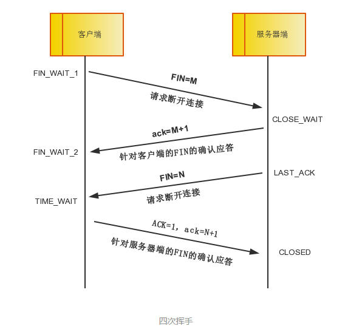

# 浏览器访问

输入URL回车之后,究竟发生了什么

1. 查找域名的IP地址
2. 浏览器与目标服务器建立TCP连接
3. 浏览器通过http协议发送请求
4. 某些服务会做永久重定向响应，然后浏览器跟踪重定向地址
5. 服务器发出一个HTML响应
6. 释放TCP连接
7. 浏览器显示页面

# OSI参考模型

七层简写：应表会传网数物

应用层 smtp ssh ftp

表示层 设备固有数据格式与网络标准数据格式的转换

会话层 管理通信连接的建立和断开（的时机）

传输层 负责可靠传输，实际建立连接和断开

网络层 寻址和路由选择

数据链路层 设备间传送和识别数据帧

- 物理层 实现相邻计算机节点之间比特流的透明传送，尽可能屏蔽掉具体传输介质和物理设备的差异，简而言之就是01比特与电压间的转换。

# 传输方式

面向有连接型

面向无连接型

电路交换和分组交换

# 网络构成

网桥

数据链路层上延长网络

如交换集线器

路由器

ip层转发

以太网：局域网通信的技术标准

局域网、广域网、互联网的概念只是范围不同

网关：从传输层到应用层的数据进行转换和转发

如防火墙、代理服务器、应用层协议转换（电子邮件）

# TCPIP

tcp/ip是互联网的协议族。相比osi参考模型，tcp/ip更侧重于技术实现规范。

四层：

- 应用层

- 传输层 

- 互联网层  osi网络层

- 网卡层 osi数据链路层

tcpip协议大多以客户端/服务端程序运行，服务端程序在unix中叫守护进程。

超级守护进程负责根据端口号转发请求，fork并转换为各种守护进程，如sshd、httpd。

可靠传输

通过以下机制保证可靠传输：

- 检验和
- 序列号
- 确认应答（ACK) 。握手中ack是发送时seq+1，数据传输时将下一步应该接收的序列号作为ack返回。
- 重发控制
- 连接管理
- 窗口控制。

## TCP报文

报文头里比较重要的字段有：

- Seq序号，占32位，用来标识从TCP源端向目的端发送的字节流，发起方发送数据时对此进行标记。

- 确认号（acknowledgement number）：Ack序号，占32位，只有ACK标志位为1时，确认序号字段才有效，Ack=Seq+1。

- 标志位（Flags）：共6个，即URG、ACK、PSH、RST、SYN、FIN等。

标志位具体含义如下：

- URG：紧急指针（urgent pointer）有效。
- ACK：确认序号有效。
- PSH：接收方应该尽快将这个报文交给应用层。
- RST：重置连接。
- SYN：发起一个新连接。
- FIN：释放一个连接。

## 三次握手

https://www.cnblogs.com/Qing-840/p/9283367.html

http://blog.chinaunix.net/attachment/201304/8/22312037_1365405910EROI.png

1. 第一次握手。Client向Server发送一段TCP报文，：
   1. 标志位SYN置为1，表示“请求建立新连接”
   2. 随机产生一个值seq=x，
   3. Client进入SYN_SENT状态，等待Server确认。
2. 第二次握手。Server接收到来自Client的TCP报文之后，结束LISTEN阶段，由标志位SYN=1知道Client请求建立连接，随后返回一段TCP报文，其中：
   1. Server将标志位SYN和ACK都置为1。表示“确认客户端的报文Seq序号有效，服务器能正常接收客户端发送的数据，并同意创建新连接”（即告诉客户端，服务器收到了你的数据）
   2. 随机产生Seq=y
   3. 确认号为Ack=x+1，表示收到客户端的序号Seq并将其值加1作为自己确认号Ack的值；随后Server进入SYN-RCVD阶段。
3. 第三次握手：Client收到确认后，检查确认号Ack是否为X+1，标志位ACK是否为1，如果正确则Client结束SYN-SENT阶段。并返回报文：
   1. 标志位ACK设为1，表示“确认收到服务器端同意连接的信号”（即告诉服务器，我知道你收到我发的数据了）
   2. 序号为Seq=x+1，表示收到服务器端的确认号Ack，并将其值作为自己的序号值；
   3. 确认号为Ack=y+1，表示收到服务器端序号Seq，并将其值加1作为自己的确认号Ack的值
   4. 随后Client进入ESTABLISHED阶段。
   5. Server收到来自Client的TCP报文，检查ack是否为y+1，ACK是否为1，如果正确则连接建立成功，Server进入ESTABLISHED状态，完成三次握手，随后Client与Server之间可以开始传输数据了。

为什么要三次握手？

第一次握手：Client 什么都不能确认；Server 确认了对方发送正常，自己接收正常

第二次握手：Client 确认了：自己发送、接收正常，对方发送、接收正常；Server 确认了：对方发送正常，自己接收正常

第三次握手：Client 确认了：自己发送、接收正常，对方发送、接收正常；Server 确认了：自己发送、接收正常，对方发送、接收正常

所以三次握手就能确认双发收发功能都正常，缺一不可。

## 四次挥手

四次挥手（Four-Way Wavehand）即终止TCP连接

        （1）第一次挥手：Client发送一个FIN，用来关闭Client到Server的数据传送，Client进入FIN_WAIT_1状态。
        （2）第二次挥手：Server收到FIN后，发送一个ACK给Client，确认序号为收到序号+1（与SYN相同，一个FIN占用一个序号），Server进入CLOSE_WAIT状态。
        （3）第三次挥手：Server发送一个FIN，用来关闭Server到Client的数据传送，Server进入LAST_ACK状态。
        （4）第四次挥手：Client收到FIN后，Client进入TIME_WAIT状态，接着发送一个ACK给Server，确认序号为收到序号+1，Server进入CLOSED状态，完成四次挥手。
http://blog.chinaunix.net/attachment/201304/9/22312037_1365503104wDR0.png

为什么是四次握手，而不把第二次和第三次合为一次FIN/ACK?

因为TCP是全双工通信的。第二次和第三次挥手之间，被动方可能还有未发送处理的报文。

   （1）第一次挥手

​     因此当主动方发送断开连接的请求（即FIN报文）给被动方时，仅仅代表主动方不会再发送数据报文了，但主动方仍可以接收数据报文。

​    （2）第二次挥手

​     被动方此时有可能还有相应的数据报文需要发送，因此需要先发送ACK报文，告知主动方“我知道你想断开连接的请求了”。这样主动方便不会因为没有收到应答而继续发送断开连接的请求（即FIN报文）。

   （3）第三次挥手

​    被动方在处理完数据报文后，便发送给主动方FIN报文；这样可以保证数据通信正常可靠地完成。发送完FIN报文后，被动方进入LAST_ACK阶段（超时等待）。

   （4）第四挥手

​    如果主动方及时发送ACK报文进行连接中断的确认，这时被动方就直接释放连接，进入可用状态。

## TCP可靠传输

TCP 协议如何保证可靠传输

1. 应用数据被分割成 TCP 认为最适合发送的数据块。
2. TCP 给发送的每一个包进行编号，接收方对数据包进行排序，把有序数据传送给应用层。
3. **校验和：** TCP 将保持它首部和数据的检验和。这是一个端到端的检验和，目的是检测数据在传输过程中的任何变化。如果收到段的检验和有差错，TCP 将丢弃这个报文段和不确认收到此报文段。
4. TCP 的接收端会丢弃重复的数据。
5. **流量控制：** TCP  连接的每一方都有固定大小的缓冲空间，TCP的接收端只允许发送端发送接收端缓冲区能接纳的数据。当接收方来不及处理发送方的数据，能提示发送方降低发送的速率，防止包丢失。TCP  使用的流量控制协议是可变大小的滑动窗口协议。 （TCP 利用滑动窗口实现流量控制）
6. **拥塞控制：** 当网络拥塞时，减少数据的发送。
7. **ARQ协议：** 也是为了实现可靠传输的，它的基本原理就是每发完一个分组就停止发送，等待对方确认。在收到确认后再发下一个分组。
8. **超时重传：** 当 TCP 发出一个段后，它启动一个定时器，等待目的端确认收到这个报文段。如果不能及时收到一个确认，将重发这个报文段。

### 窗口控制

包往返时间越长通信性能越低。

发送一个段后可以继续发送，一个窗口相当于批量发送多个段，窗口大小就是无需等待确认应答就可以继续发送数据的最大值。

**滑动窗口**

在整个窗口的确认应答没有到达之前，如果其中部分数据丢包，那么发送端仍然要重传。因此发送端必须缓存保留这些待重传的数据，每当收到确认应答，就将窗口滑动到Ack序列号的位置（清楚数据）。

数据丢失问题解决：

- 某些确认应答丢失也无需重发，可以通过下一个确认应答进行确认
- 发送的报文段（1001~2000）丢失时，接收端会再重复3次上一次的确认应答（下一个是1001），发送端如果连续收到3次收到同一个确认应答，就会重发对应数据（1001~2000）。发送方丢失报文到重发期间，后续（2000~7000）的报文正常发送，只是接收端确认应答异常，重发后确认应答恢复正常。

### 流量控制

TCP首部中，接收端主机将自己可以接收的缓冲区大小（窗口大小）放入这个字段通知给发送端。

接收端缓冲区溢出时，窗口大小的值会设置更小（甚至为0）。

### 拥塞控制

为了进行拥塞控制，TCP 发送方要维持一个 **拥塞窗口(cwnd)** 的状态变量。拥塞控制窗口的大小取决于网络的拥塞程度，并且动态变化。发送方让自己的发送窗口取为拥塞窗口和接收方的接受窗口中较小的一个。

TCP的拥塞控制采用了四种算法，即 **慢开始** 、 **拥塞避免** 、**快重传** 和 **快恢复**。在网络层也可以使路由器采用适当的分组丢弃策略（如主动队列管理 AQM），以减少网络拥塞的发生。

发送端最初的窗口很小，慢启动修正。指数增长超过阈值（最初没有阈值，超时后设置为当时窗口的一般）后，涨幅减少。

超时重发说明拥堵严重，窗口降为1

重复确认应答触发高速重发时，设置窗口为之前的一半。

## 应用协议

发送端邮件根据SMTP协议被转发到POP服务器。

客户端根据POP协议从POP服务器接收对方发来的邮件。

IMAP协议类似POP，POP中邮件是客户端管理，IMAP中邮件由服务器进行管理，保存已读未读等信息。